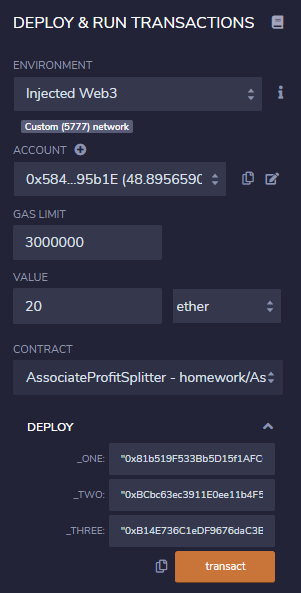
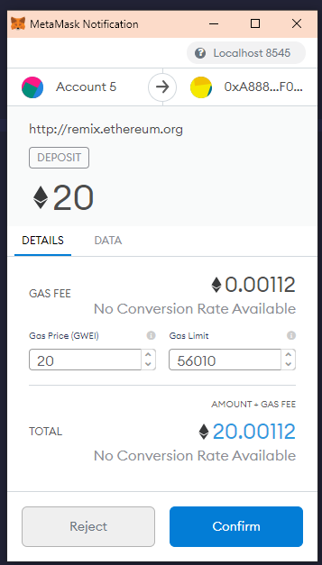
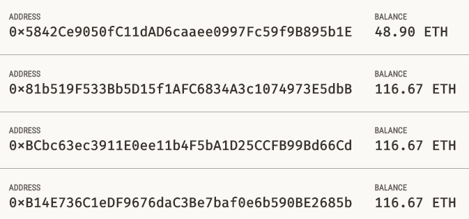
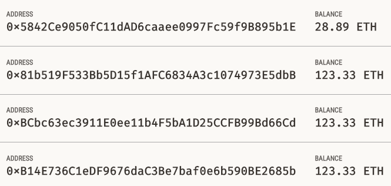
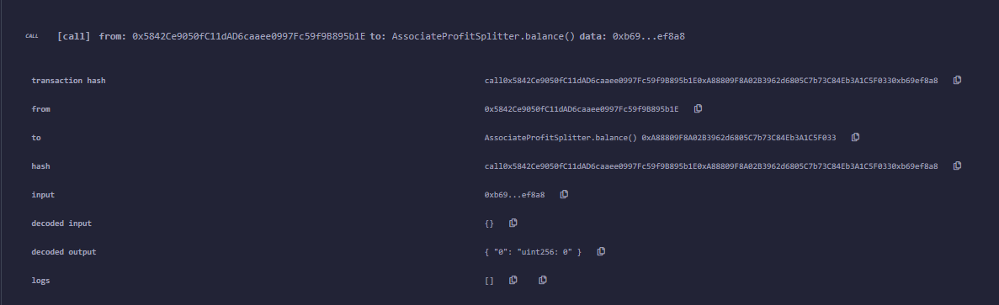

# Profit Splitter
---
## Associate Profit Splitter contract
---
This contract has two functions:
1. Deposit - Set to public payable to ensure that only the owner can call the function, equally split the value of ether and transfer to the employee addresses
2. Balance - This function should be set to public view returns(uint), and must return the contract's current balance. Since we should always be sending ether to the beneficiaries, this function should always return 0. If it does not, the deposit function is not handling the remainders properly and should be fixed. This will serve as a test function of sorts.

### Testing the Contract
---
  
Deploy contract to the local Ganache chain by connecting to Injected Web3 and connecting MetaMask to localhost:8545  
  
After deploying the contract, you can initiate the deposit function to evenly split the amount and transfer to the nominated addresses  
  
Take note the balances before and after the transfer  
  
The balance function below should always return 0  
